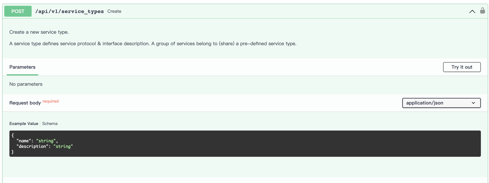
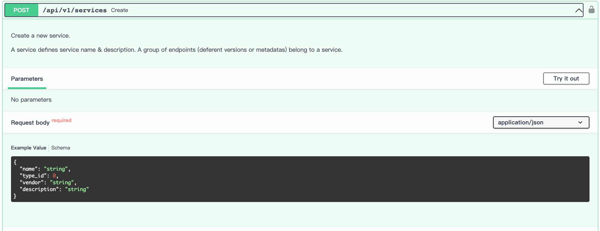
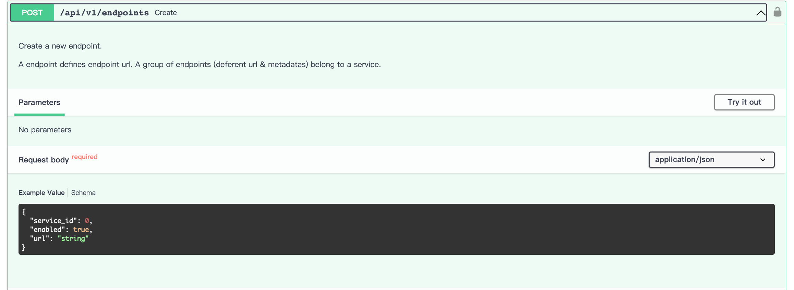
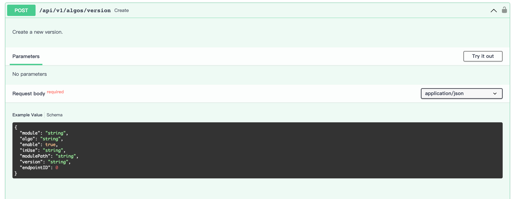

以 OpenV2X 中超速算法为例（目前仅超速算法实现访问外部算法）：

- 查看超速算法目前支持的外部协议（ service_type ）

  - https://github.com/open-v2x/dandelion/blob/master/dandelion/constants.py 在该链接中，查看 DEFAULT_ALGO
    变量，找到 overspeed_warning 部分。

    ```python
    DEFAULT_ALGO: str = """
    rsi_formatter:
      algos:
        rsi_formatter:
          enable: true
          module: "transform_driver.rsi_service"
          algo: "rsi"
          version:
          - rsi
    pre_process_ai_algo:
      algos:
        complement:
          enable: true
          module: "pre_process_ai_algo.algo_lib.complement"
          algo: "interpolation"
          version: 
          - interpolation
          - lstm_predict
        fusion:
          enable: false
          module: "pre_process_ai_algo.algo_lib.fusion"
          algo: "fusion"
          version:
          - fusion
        smooth:
          enable: true
          module: "pre_process_ai_algo.algo_lib.smooth"
          algo: "exponential"
          version:
          - exponential
          - polynomial
        visual:
          enable: true
          module: "pre_process_ai_algo.pipelines.visualization"
          algo: "visual"
          version:
          - visual
    scenario_algo:
      algos:
        collision_warning:
          enable: true
          module: "scenario_algo.algo_lib.collision_warning"
          algo: "collision_warning"
          version:
          - collision_warning
        cooperative_lane_change:
          enable: true
          module: "scenario_algo.algo_lib.cooperative_lane_change"
          algo: "cooperative_lane_change"
          version:
          - cooperative_lane_change
        do_not_pass_warning:
          enable: true
          module: "scenario_algo.algo_lib.do_not_pass_warning"
          algo: "do_not_pass_warning"
          version:
          - do_not_pass_warning
        sensor_data_sharing:
          enable: true
          module: "scenario_algo.algo_lib.sensor_data_sharing"
          algo: "sensor_data_sharing"
          version:
          - sensor_data_sharing
        reverse_driving_warning:
          enable: true
          module: "scenario_algo.algo_lib.reverse_driving_warning"
          algo: "reverse_driving_warning"
          version:
          - reverse_driving_warning
        congestion_warning:
          enable: true
          module: "scenario_algo.algo_lib.congestion_warning"
          algo: "congestion_warning"
          version:
          - congestion_warning
        overspeed_warning:
          enable: true
          module: "scenario_algo.algo_lib.overspeed_warning"
          algo: "overspeed_warning"
          version:
          - overspeed_warning
          service_types:
          - algo/scenario_algo/overspeed_warning/http
          - algo/scenario_algo/overspeed_warning/websocket
          - algo/scenario_algo/overspeed_warning/grpc
        slowspeed_warning:
          enable: true
          module: "scenario_algo.algo_lib.slowspeed_warning"
          algo: "slowspeed_warning"
          version:
          - slowspeed_warning
    post_process_algo:
      algos:
        post_process:
          enable: true
          module: "post_process_algo.post_process"
          algo: "post_process"
          version:
          - post_process
    """
    ```

    如代码所示，超速算法目前支持三种 service_type，分别为
    algo/scenario_algo/overspeed_warning/http、algo/scenario_algo/overspeed_warning/websocket、algo/scenario_algo/overspeed_warning/grpc，即
    http、websocket、grpc 三种协议。

- 创建外部算法服务

  - 参数，超速算法输入 context_frames、current_frame、last_timestamp、speed_limits 四个参数。参数数据结构参考
    https://zhc3o5gmf9.feishu.cn/docx/BUy3d9PGeoz11Ax35BqcAjZfnkm ，输出 osw、info.

    - context_frames: dict

      - Algorithm's historical frame data, obtained from the result of the last call, AID format

      - ```json
        {
            'ad267de': [
                {
                    'secMark': 44100,
                    'ptcType': 'motor',
                    'x': 21.340245294356347,
                    'y': 59.476862239377056,
                    'speed': 458,
                    'heading': 6677,
                    'global_track_id': 'ad267de',
                    'refPos_lat': 319348466,
                    'refPos_lon': 1188213963,
                    'refPos_ele': None,
                    'lat': 319353751,
                    'lon': 1188216134,
                    'ele': None,
                    'ptcId': 267,
                    'source': 3,
                    'lane': 12,
                    'width': 240,
                    'length': 700,
                    'height': 47,
                    'timeStamp': 44100
                }
            ]
        }
        ```

    - current_frame: dict

      - latest frame data, AID format

      - ```json
        {
            'ad267de': {
                'secMark': 45600,
                'ptcType': 'motor',
                'x': 70.59728125029123,
                'y': 54.61238959971436,
                'speed': 458,
                'heading': 6880,
                'global_track_id': 'ad267de',
                'refPos_lat': 319348466,
                'refPos_lon': 1188213963,
                'refPos_ele': None,
                'lat': 319353364,
                'lon': 1188221348,
                'ele': None,
                'ptcId': 267,
                'source': 3,
                'lane': 12,
                'width': 240,
                'length': 700,
                'height': 47,
                'timeStamp': 45600
            }
        }
        ```

    - last_timestamp: int

      - The current frame data timestamp when the algorithm function was last called

      - ```
        45600
        ```

    - speed_limits: dict

      - Lane speed limit

      - ```json
        {
            14: {'vehicleMaxSpeed': 833, 'vehicleMinSpeed': 833},
            15: {'vehicleMaxSpeed': 833, 'vehicleMinSpeed': 833},
            20: {'vehicleMaxSpeed': 833, 'vehicleMinSpeed': 833},
            21: {'vehicleMaxSpeed': 833, 'vehicleMinSpeed': 833},
            22: {'vehicleMaxSpeed': 833, 'vehicleMinSpeed': 833},
            16: {'vehicleMaxSpeed': 833, 'vehicleMinSpeed': 833},
            17: {'vehicleMaxSpeed': 833, 'vehicleMinSpeed': 833},
            18: {'vehicleMaxSpeed': 833, 'vehicleMinSpeed': 833},
            19: {'vehicleMaxSpeed': 833, 'vehicleMinSpeed': 833},
            23: {'vehicleMaxSpeed': 833},
            24: {'vehicleMaxSpeed': 833},
            1: {'vehicleMaxSpeed': 833},
            4: {'vehicleMaxSpeed': 833, 'vehicleMinSpeed': 833},
            5: {'vehicleMaxSpeed': 833, 'vehicleMinSpeed': 833},
            6: {'vehicleMaxSpeed': 833, 'vehicleMinSpeed': 833},
            7: {'vehicleMaxSpeed': 833, 'vehicleMinSpeed': 833},
            11: {'vehicleMaxSpeed': 833, 'vehicleMinSpeed': 833},
            12: {'vehicleMaxSpeed': 833, 'vehicleMinSpeed': 833},
            13: {'vehicleMaxSpeed': 833, 'vehicleMinSpeed': 833},
            8: {'vehicleMaxSpeed': 833, 'vehicleMinSpeed': 833},
            9: {'vehicleMaxSpeed': 833, 'vehicleMinSpeed': 833},
            10: {'vehicleMaxSpeed': 833, 'vehicleMinSpeed': 833},
            2: {'vehicleMaxSpeed': 833, 'vehicleMinSpeed': 833},
            3: {'vehicleMaxSpeed': 833, 'vehicleMinSpeed': 833}
        }
        ```

    - osw: list

      - Overspeed warning message for broadcast, osw format

      - ```json
        [
            {
                'secMark': 45600,
                'egoInfo': {
                    'egoId': 'ad267de',
                    'egoPos': {
                        'lat': 319353364,
                        'lon': 1188221348
                    },
                    'speed': 1649,
                    'heading': 6880,
                    'width': 240,
                    'length': 700,
                    'height': 47
                }
            },
            {
                'secMark': 45600,
                'egoInfo': {
                    'egoId': 'ad148de',
                    'egoPos': {
                        'lat': 319353106,
                        'lon': 1188221102
                    },
                    'speed': 1649,
                    'heading': 6880,
                    'width': 180,
                    'length': 500,
                    'height': 30
                }
            }
        ]
        ```

    - info: list

      - event

      - ```json
        [
            {
                'ego': 'ad267de',
                'ego_current_point': [
                    70.59728125029123,
                    54.61238959971436
                ]
            },
            {
                'ego': 'ad148de',
                'ego_current_point': [
                    68.24130127892317,
                    51.774668154268696
                ]
            }
        ]
        ```

      -

  - http

    - 输入:

      - 请求体参数

      - ```json
        {
          "context_frames":context_frames,
          "current_frame":current_frame,
          "last_timestamp":last_timestamp,
          "speed_limits":speed_limits
        }
        ```

    - 输出

      - response

      - ```json
        {
          "osw":osw,
          "info":info
        }
        ```

  - websocket

    - 输入

      - Json 字符串

      - ```json
        {
          "context_frames":context_frames,
          "current_frame":current_frame,
          "last_timestamp":last_timestamp,
          "speed_limits":speed_limits
        }
        ```

    - 输出

      - Json 字符串

      - ```json
        {
          "osw":osw,
          "info":info
        }
        ```

  - grpc:

    - 输入

      - Json 字符串

      - data

        - ```json
          {
            "context_frames":context_frames,
            "current_frame":current_frame,
            "last_timestamp":last_timestamp,
            "speed_limits":speed_limits
          }
          ```

    - 输出

      - Json 字符串

      - data

        - ```json
          {
            "osw":osw,
            "info":info
          }
          ```

    - proto

      - ```protobuf
        // Copyright 2015 gRPC authors.
        //
        // Licensed under the Apache License, Version 2.0 (the "License");
        // you may not use this file except in compliance with the License.
        // You may obtain a copy of the License at
        //
        //     http://www.apache.org/licenses/LICENSE-2.0
        //
        // Unless required by applicable law or agreed to in writing, software
        // distributed under the License is distributed on an "AS IS" BASIS,
        // WITHOUT WARRANTIES OR CONDITIONS OF ANY KIND, either express or implied.
        // See the License for the specific language governing permissions and
        // limitations under the License.

        syntax = "proto3";

        package over_speed_grpc;

        service OverSpeedGrpc {
          rpc over_speed (OverSpeedRequest) returns (OverSpeedResponse) {}
        }

        message OverSpeedRequest {
          string data = 1;
        }

        message OverSpeedResponse {
          string data = 2;

        }
        ```

  - 根据上述参数，创建相应服务。

- 将外部算法添加到 OpenV2X

  - 接口文档地址：http://47.100.126.13:28300/docs ， Algo、Service 部分。

  - 创建 service_type，其中 name 要与上述 DEFAULT_ALGO 中 service_type 一致。

    

  - 创建 service，其中 type_id 为 service_type 的 id，使用外键进行关联。

    

  - 创建 endpoint，其中 service_id 为 service 的 id，使用外键进行关联，url 为服务地址。

    

  - 创建 algo version，可以在 http://47.100.126.13:2288/algorithm/version 页面操作，或者直接调用接口，其中
    enable、inUse、modulePath 非必填，ednpointID 为 endpoint 的 id，使用外键进行关联。

    

  - 选择算法使用的版本为，创建的版本
    - 在算法配置 http://47.100.126.13:2288/algorithm/config 页面选择创建的外部算法。
  - 重启 cerebrum 服务

- cerebrum 目前超速算法支持了 http、websocket、grpc 三种外部协议，具体可以参考
  https://github.com/open-v2x/cerebrum/tree/master/scenario_algo/external
- cerebrum 中超速算法已实现外部 demo， 可以参考
  https://github.com/open-v2x/cerebrum/tree/master/overspeed_warning_service
