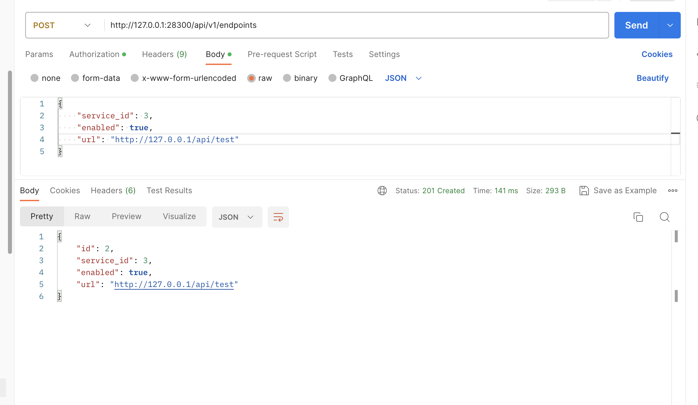

OpenV2X 基于 “简单、可扩展” 原则，在 columbia 版本中支持了算法的外置。cerebrum 目前超速算法支持了 http、websocket、grpc
三种外部[协议](https://github.com/open-v2x/cerebrum/tree/master/scenario_algo/external)。同时 cerebrum
中超速算法已实现外部
[demo](https://github.com/open-v2x/cerebrum/tree/master/overspeed_warning_service)。本文主要是以超速算法为例，展示具体如何添加外部算法。

- 要为超速算法添加外部算法，首先需要知道 OpenV2X 中超速算法支持的外部协议。参考 dandelion 中对于
  [DEFAULT_ALGO](https://github.com/open-v2x/dandelion/blob/master/dandelion/constants.py)
  的定义。找到超速算法 overspeed_warning 部分。如下代码所示，超速算法目前支持三种 service_type，分别为 http、websocket、grpc。

  ```yaml
  overspeed_warning:
    enable: true
    module: "scenario_algo.algo_lib.overspeed_warning"
    algo: "overspeed_warning"
    version:
      - overspeed_warning
    service_types:
      - algo/scenario_algo/overspeed_warning/http
      - algo/scenario_algo/overspeed_warning/websocket
      - algo/scenario_algo/overspeed_warning/grpc
  ```

- 知道 OpenV2X 中超速算法支持的外置协议类型，接下来需要知道每种协议的输出、输出。

  - 超速算法中涉及到的参数主要有六个，其中输入参数四个分别为：context_frames、current_frame、last_timestamp、speed_limits，输出参数两个分别为
    osw、info。参数字段说明参考标准《CSAE157-2020合作式智能运输系统车用通信系统应用层及应用数据交互标准（第二阶段）》

  * 参数介绍

    - context_frames: Algorithm's historical frame data, obtained from the result of the last call,
      AID format

      ```json
      {
          "ad267de": [
              {
                  "secMark": 44100,
                  "ptcType": "motor",
                  "x": 21.340245294356347,
                  "y": 59.476862239377056,
                  "speed": 458,
                  "heading": 6677,
                  "global_track_id": "ad267de",
                  "refPos_lat": 319348466,
                  "refPos_lon": 1188213963,
                  "refPos_ele": null,
                  "lat": 319353751,
                  "lon": 1188216134,
                  "ele": null,
                  "ptcId": 267,
                  "source": 3,
                  "lane": 12,
                  "width": 240,
                  "length": 700,
                  "height": 47,
                  "timeStamp": 44100
              }
          ]
      }
      ```

    - current_frame: latest frame data, AID format

      ```json
      {
          "ad267de": {
              "secMark": 45600,
              "ptcType": "motor",
              "x": 70.59728125029123,
              "y": 54.61238959971436,
              "speed": 458,
              "heading": 6880,
              "global_track_id": "ad267de",
              "refPos_lat": 319348466,
              "refPos_lon": 1188213963,
              "refPos_ele": null,
              "lat": 319353364,
              "lon": 1188221348,
              "ele": null,
              "ptcId": 267,
              "source": 3,
              "lane": 12,
              "width": 240,
              "length": 700,
              "height": 47,
              "timeStamp": 45600
          }
      }
      ```

    - last_timestamp: The current frame data timestamp when the algorithm function was last called

      ```q
      45600
      ```

    - speed_limits: Lane speed limit

      ```json
      {
          "14": {"vehicleMaxSpeed": 833, "vehicleMinSpeed": 833},
          "15": {"vehicleMaxSpeed": 833, "vehicleMinSpeed": 833},
          "20": {"vehicleMaxSpeed": 833, "vehicleMinSpeed": 833},
          "21": {"vehicleMaxSpeed": 833, "vehicleMinSpeed": 833},
          "22": {"vehicleMaxSpeed": 833, "vehicleMinSpeed": 833},
          "16": {"vehicleMaxSpeed": 833, "vehicleMinSpeed": 833},
          "17": {"vehicleMaxSpeed": 833, "vehicleMinSpeed": 833},
          "18": {"vehicleMaxSpeed": 833, "vehicleMinSpeed": 833},
          "19": {"vehicleMaxSpeed": 833, "vehicleMinSpeed": 833},
          "23": {"vehicleMaxSpeed": 833},
          "24": {"vehicleMaxSpeed": 833},
          "1": {"vehicleMaxSpeed": 833},
          "4": {"vehicleMaxSpeed": 833, "vehicleMinSpeed": 833},
          "5": {"vehicleMaxSpeed": 833, "vehicleMinSpeed": 833},
          "6": {"vehicleMaxSpeed": 833, "vehicleMinSpeed": 833},
          "7": {"vehicleMaxSpeed": 833, "vehicleMinSpeed": 833},
          "11": {"vehicleMaxSpeed": 833, "vehicleMinSpeed": 833},
          "12": {"vehicleMaxSpeed": 833, "vehicleMinSpeed": 833},
          "13": {"vehicleMaxSpeed": 833, "vehicleMinSpeed": 833},
          "8": {"vehicleMaxSpeed": 833, "vehicleMinSpeed": 833},
          "9": {"vehicleMaxSpeed": 833, "vehicleMinSpeed": 833},
          "10": {"vehicleMaxSpeed": 833, "vehicleMinSpeed": 833},
          "2": {"vehicleMaxSpeed": 833, "vehicleMinSpeed": 833},
          "3": {"vehicleMaxSpeed": 833, "vehicleMinSpeed": 833}
      }
      ```

    - osw: Overspeed warning message for broadcast, osw format

      ```json
      [
          {
              "secMark": 45600,
              "egoInfo": {
                  "egoId": "ad267de",
                  "egoPos": {
                      "lat": 319353364,
                      "lon": 1188221348
                  },
                  "speed": 1649,
                  "heading": 6880,
                  "width": 240,
                  "length": 700,
                  "height": 47
              }
          },
          {
              "secMark": 45600,
              "egoInfo": {
                  "egoId": "ad148de",
                  "egoPos": {
                      "lat": 319353106,
                      "lon": 1188221102
                  },
                  "speed": 1649,
                  "heading": 6880,
                  "width": 180,
                  "length": 500,
                  "height": 30
              }
          }
      ]
      ```

    - info: event data

      ```json
      [
          {
              "ego": "ad267de",
              "ego_current_point": [
                  70.59728125029123,
                  54.61238959971436
              ]
          },
          {
              "ego": "ad148de",
              "ego_current_point": [
                  68.24130127892317,
                  51.774668154268696
              ]
          }
      ]
      ```

  * 各协议具体参数

    - http

      - 输入: post/body

        ```json
        {
            "context_frames": "上述 context_frames",
            "current_frame": "上述 current_frame",
            "last_timestamp": "上述 last_timestamp",
            "speed_limits": "上述 speed_limits"
        }
        ```

      - 输出: Http response

        ```json
        {
          "osw":"上述 osw",
          "info":"上述 info"
        }
        ```

    - websocket

      - 输入: json

        ```json
        {
            "context_frames": "上述 context_frames",
            "current_frame": "上述 current_frame",
            "last_timestamp": "上述 last_timestamp",
            "speed_limits": "上述 speed_limits"
        }
        ```

      - 输出: json

        ```json
        {
          "osw":"上述 osw",
          "info":"上述 info"
        }
        ```

    - grpc:

      - 输入: json

        - data

          ```json
          {
              "context_frames": "上述 context_frames",
              "current_frame": "上述 current_frame",
              "last_timestamp": "上述 last_timestamp",
              "speed_limits": "上述 speed_limits"
          }
          ```

      - 输出: json

        - data

          ```json
          {
            "osw": "上述 osw",
            "info": "上述 info"
          }
          ```

      - proto 示例

        ```protobuf
        // Copyright 2015 gRPC authors.
        //
        // Licensed under the Apache License, Version 2.0 (the "License");
        // you may not use this file except in compliance with the License.
        // You may obtain a copy of the License at
        //
        //     http://www.apache.org/licenses/LICENSE-2.0
        //
        // Unless required by applicable law or agreed to in writing, software
        // distributed under the License is distributed on an "AS IS" BASIS,
        // WITHOUT WARRANTIES OR CONDITIONS OF ANY KIND, either express or implied.
        // See the License for the specific language governing permissions and
        // limitations under the License.

        syntax = "proto3";

        package over_speed_grpc;

        service OverSpeedGrpc {
        rpc over_speed (OverSpeedRequest) returns (OverSpeedResponse) {}
        }

        message OverSpeedRequest {
        	string data = 1;
        }

        message OverSpeedResponse {
        	string data = 2;
        }
        ```

* 参考上述创建好相应的外部算法后，将外部算法添加到 OpenV2X，可以参考相关 [API 文档](http://47.100.126.13:28300/docs) 中 Algo、Service
  部分，以及下图dandelion 模块中关于算法与其外置部分的表关系图。

  - 创建 service_type，其中 name 要与上述 DEFAULT_ALGO 中 service_type 一致。如下是超速算法创建 http 协议 service_type。

    

  * 创建 service，其中 type_id 为 service_type 的 id，使用外键进行关联。

    

  * 创建 endpoint，其中 service_id 为 service 的 id，使用外键进行关联，url 为外置算法服务地址。比如下图为 http 外置算法的 api url。

    
  - 创建 algo version，在 [dashboard](http://47.100.126.13:2288/algorithm/version) 页面操作，其中算法服务网络地址为在
    endpoint 中添加的 url。

    

  - 选择算法使用的 version 为刚创建的。

    

* 重启 cerebrum 服务，这时候 cerebrum 会从 dandelion 获知当前超速算法使用的是 http 协议外置算法及 http 外置算法的 api url。
