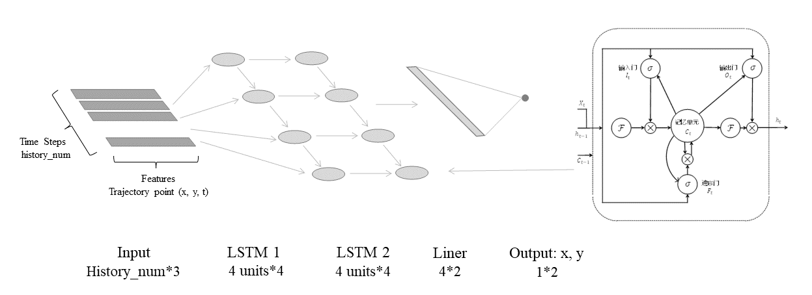
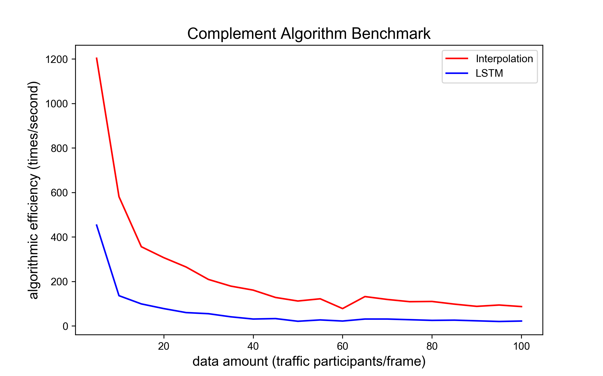
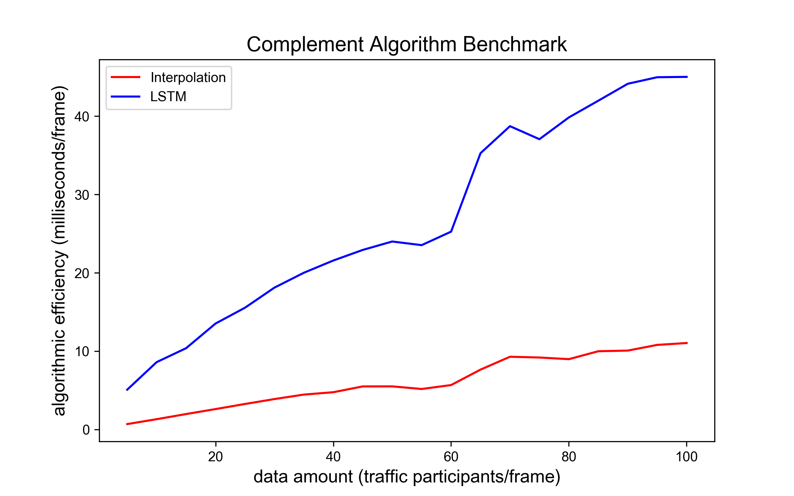

# 在线轨迹补全算法 (Complement)

## 概览

### _目录_

<!-- @import "[TOC]" {cmd="toc" depthFrom=1 depthTo=6 orderedList=false} -->

<!-- code_chunk_output -->

- [在线轨迹补全算法 (Complement)](#在线轨迹补全算法-complement)
  - [1. 概览](#概览)
    - [1.1 补全算法目标](#补全算法目标)
    - [1.2 难点与挑战](#难点与挑战)
  - [2. 两种补全算法](#两种补全算法)
    - [2.1 插值补全](#插值补全)
      - [2.1.1 插值算法介绍](#插值算法介绍)
      - [2.1.2 插值公式](#插值公式)
      - [2.1.3 算法输入、输出与调控参数](#算法输入、输出与调控参数)
      - [2.1.4 插值算法逻辑](#插值算法逻辑)
    - [2.2 基于 LSTM 的补全算法](#基于-LSTM-的补全算法)
      - [2.2.1 LSTM 介绍](#-LSTM-介绍)
      - [2.2.2 算法输入、输出与调控参数](#算法输入、输出与调控参数)
      - [2.2.3 算法逻辑](#算法逻辑)
      - [2.2.4 LSTM 结构与精度评价](#-LSTM-结构与精度评价)
    - [2.3 两种算法 BenchMark](#两种算法-BenchMark)
  - [3. 算法代码框架](#算法代码框架)
    - [3.1 继承关系](#继承关系)
    - [3.2 调用关系](#调用关系)
  - [4. 参数解析](#参数解析)
  - [5. 算法代码解析](#算法代码解析)
  - [6. 附录](#附录)
    - [参考文献](#参考文献)
    - [Configuration](#configuration)

<!-- /code_chunk_output -->

## 1. 概览

### 1.1 补全算法目标

在线轨迹补全指对于由车辆遮挡、检测丢失等问题引起的车辆轨迹断续的情况进行修正与填补。

车辆轨迹数据是由诸如
gps、雷达、摄像头等设备采集的，但是由于设备本身可能存在故障，导致采集的轨迹数据产生定位误差或者固有误差，而且在某些特殊的情况下，设备会受定位精度、采集频率以及系统误差的影响，容易出现没有采集或记录的现象，从而导致采集的轨迹数据出现部分缺失。因此需要通过获取车辆的历史轨迹点，实现对中间缺失值的差值补全。

### 1.2 难点与挑战

不同原因引起的轨迹断续特征各不相同，不同厂商的检测丢失特征也不相同，如何**适配不同厂商的检测精度**同时**实现对高频并发数据的在线处理**是补全算法的难点。

## 2. 两种补全算法

### 2.1 插值补全

### 2.1.1 插值算法介绍

高度依赖车辆轨迹信息的准确性。在线插值轨迹补全算法通过牺牲 3-5 帧（12-20 ms）的实时性，获取车辆的历史轨迹点，实现对中间缺失值的差值补全。

### 2.1.2 插值公式

插值补全公式

$$x_T=x_{k-1}+(x_{k+1} - x_{k-1})\times\frac{T - t_{k-1}}{t_{k+1}-t_{k-1}}$$

其中 $T$ 为待补全时间戳，即 `delay_sec_mark`，$x_{T}$ 表示补全位置结果，$x_{k-1}$、$x_{k-1}$ 为缺失时间前后帧位置,
$t_{k-1}$、$t_{k-1}$ 为缺失时间前后帧时间戳。

### 2.1.3 算法输入、输出与调控参数

| 数据类型     | 数据名称                 | 数据格式 | 备注               |
| -------- | -------------------- | ---- | ---------------- |
| **外部输入** | context_frames       | dict | 历史轨迹信息           |
| **外部输入** | current_frame        | dict | 当前轨迹信息           |
| **外部输入** | last_timestamp       | int  | 最新一帧时间戳 ｜        |
| **调控参数** | lag_time             | int  | 补全滞后时长           |
| **调控参数** | max_speed_motor      | int  | 机动车的允许最大补全速度     |
| **调控参数** | max_speed_non_motor  | int  | 非动车的允许最大补全速度     |
| **调控参数** | max_speed_pedestrian | dict | 行人的允许最大补全速度      |
| **输出**   | updated_latest_frame | dict | 补全更新后的最后一帧车辆轨迹信息 |
| **输出**   | last_timestamp       | int  | 更新后的最后一帧时间戳      |

### 2.1.4 插值算法逻辑

1. 基于当前的 `secMark`（分钟内毫秒时间），向前推迟 `lag_time`，得到需要补全的 `delay_secMark` 时刻
2. 对于每一辆车，寻找是否具有 `delay_secMark` 刻的轨迹点数据，若缺失则进行补全
3. 通过 `delay_secMark` 前后两帧数据的坐标，进行差值处理
4. 若通过前后两帧坐标计算的速度大于所设阈值，则放弃补全

## 2.2 基于 LSTM 的补全算法

### 2.2.1 LSTM 介绍

长短时记忆神经网络 LSTM（Long Short–Term Memory）是一种时间递归神经网络，适合于处理和预测时间序列中间隔和延迟相对较长的重要事件。 与其说长短时记忆神经网络 LSTM
是一种循环神经网络，倒不如说是一个加强版的组件被放在了循环神经网络中。

遗忘门：决定应丢弃或保留哪些信息。来自前一个隐藏状态的信息和当前输入的信息同时传递到 sigmoid 函数中去，输出值介于 0 和 1 之间，越接近 0 意味着越应该丢弃，越接近 1 意味着越应该保留

输入门：输入门用于更新细胞状态。首先将前一层隐藏状态的信息和当前输入的信息传递到 sigmoid 函数中去。将值调整到 0~1 之间来决定要更新哪些信息。0 表示不重要，1
表示重要。其次还要将前一层隐藏状态的信息和当前输入的信息传递到 tanh 函数中去，创造一个新的侯选值向量。最后将 sigmoid 的输出值与 tanh 的输出值相乘，sigmoid 的输出值将决定
tanh 的输出值中哪些信息是重要且需要保留下来的

细胞状态：前一层的细胞状态与遗忘向量逐点相乘。如果它乘以接近 0
的值，意味着在新的细胞状态中，这些信息是需要丢弃掉的。然后再将该值与输入门的输出值逐点相加，将神经网络发现的新信息更新到细胞状态中去。至此，就得到了更新后的细胞状态

输出门：输出门用来确定下一个隐藏状态的值，隐藏状态包含了先前输入的信息。首先，我们将前一个隐藏状态和当前输入传递到 sigmoid 函数中，然后将新得到的细胞状态传递给 tanh 函数。最后将
tanh 的输出与 sigmoid 的输出相乘，以确定隐藏状态应携带的信息。再将隐藏状态作为当前细胞的输出，把新的细胞状态和新的隐藏状态传递到下一个时间步长中去

### 2.2.2 算法输入、输出与调控参数

| 数据类型         | 数据名称                 | 数据格式 | 备注                    |
| ------------ | -------------------- | ---- | --------------------- |
| **外部输入**     | context_frames       | dict | 历史轨迹信息                |
| **外部输入**     | current_frame        | dict | 当前轨迹信息                |
| **外部输入**     | last_timestamp       | int  | 最新一帧时间戳 ｜             |
| **调控参数**     | lag_time             | int  | 补全滞后时长                |
| **调控参数**     | max_speed_motor      | int  | 机动车的允许最大补全速度          |
| **调控参数**     | max_speed_non_motor  | int  | 非动车的允许最大补全速度          |
| **调控参数**     | max_speed_pedestrian | dict | 行人的允许最大补全速度           |
| **LSTM调控参数** | model_path           | str  | lstm补全模型地址            |
| **LSTM调控参数** | history_num          | int  | 补全采用历史轨迹点个数，与模型训练保持一致 |
| **LSTM调控参数** | layers               | int  | 模型隐藏层层数，与模型训练保持一致     |
| **LSTM调控参数** | hidden_sz            | int  | 模型隐藏层特征纬度，与模型训练保持一致   |
| **LSTM调控参数** | bidirectional        | bool | 是否采用双向LSTM，与模型训练保持一致  |
| **输出**       | updated_latest_frame | dict | 补全更新后的最后一帧车辆轨迹信息      |
| **输出**       | last_timestamp       | int  | 更新后的最后一帧时间戳           |

### 2.2.3 算法逻辑

1. 基于当前的 `secMark`，向前推迟 `lag_time`，得到需要补全的 `delay_secMark` 时刻
2. 对于每一辆车，寻找是否具有 `delay_secMark` 刻的轨迹点数据，若缺失则进行补全
3. 通过 `delay_secMark` 前 history_num 帧的数据调用 lstm 模型预测
4. 将预测结果作为补全点插入轨迹
5. 检验前后两帧车辆速度，若速度大于所设阈值，则放弃补全

### 2.2.4 LSTM 结构与精度评价

LSTM 模型采用 4 个隐藏层，每个隐藏层含 4 个神经元。训练过程使用数据 3 万条，覆盖多向车流直行、换道、交织等交通动作。  LSTM 训练过程 30
epoches，测试 loss 由 0.02 降至 5 * 10-7，测试实现预测精度较好。

### 2.3 两种算法BenMark

测试数据结构：每辆车及其 10 帧历史数据信息

主要影响变量：data amount，每一帧数据包含的车辆数，data amount 由 1 增至 100， 插值补全算法 1 秒内运算次数由 1200 降至 100，运行单次算法耗时从 2 增至
10 毫秒。LSTM 补全算法 1 秒内运算次数由 500 降至 80，运行单次算法耗时从 5 毫秒增至 45 毫秒。
遍历车辆数据的历史数据过程随车辆数增加正比增长，导致运算速率下降。此算法满足在线要求。

 

## 3. 算法代码框架

### 3.1 继承关系

Interpolation 和 LstmPredict 类继承 Base 类，用于防止类未定义调用情况下的报错。

```python
class Base:
    def run(
        self, context_frames: dict, current_frame: dict, last_timestamp: int
    ) -> tuple:
        raise NotImplementedError


class Interpolation(Base):
    ...


class LstmPredict(Base):
    ...
```

### 3.2 调用关系

描述在线轨迹补全算法如何创建和调用

① 初始化过程调用初始化函数，创建方式如下

```python
# 创建插值补全车辆轨迹
Inter_C = Interpolation(lag_time, max_speed_motor, max_speed_non_motor, max_speed_pedestrian)

# 创建 LSTM 补全车辆轨迹
LSTM_C = LstmPredict(model_path, const_stand, history_num, layers, hidden_sz, bidirectional, lag_time, coefficient, max_speed_motor, max_speed_non_motor, max_speed_pedestrian)
```

② 调用过程由run函数执行，调用方式如下

```python
# 调用插值补全车辆轨迹
updated_latest_frame = Inter_C.run(context_frames, current_frame, last_timestamp)

# 调用 LSTM 补全车辆轨迹
updated_latest_frame = LSTM_C.run(context_frames, current_frame, last_timestamp)
```

## 4. 参数解析

| 数据类型     | 数据名称             | 数据格式 | 备注                         |
| -------- | ---------------- | ---- | -------------------------- |
| **外部输入** | his_frames[key]  |      | 交通参与者的唯一ID                 |
| **外部输入** | his_frame[value] |      | 交通参与者的轨迹点                  |
| **外部输入** | global_track_id  |      | 交通参与者的唯一ID                 |
| **外部输入** | secMark          |      | 当前轨迹点的时间戳                  |
| **外部输入** | timeStamp        |      | 当前轨迹点的时间戳                  |
| **外部输入** | ptcType          |      | 交通参与者类型：类型包括三种：机动车、非机动车、行人 |
| **外部输入** | x                |      | x坐标轴                       |
| **外部输入** | y                |      | y坐标轴                       |
| **外部输入** | speed            |      | 速度                         |
| **外部输入** | heading          |      | 航向角                        |

## 5. 算法代码解析

1、历史帧数据、当前帧数据、最新一帧时间戳首先通过 utils.frames_combination() 函数，将历史帧数据和当前帧数据拼接。 2、拼接后的数据进入
_find_delay_sec_mark 函数，找到 `delay_secmark`（需要补全的时刻），并更新历史帧 frames 的 `secmark` 。 3、插值处理（ _handle_lstm
或者 _handle_interpolation ） 通过 _find_nearest() 函数，找出离 `delay_secmark`（需要补全的时刻）最近的一帧的下标 `idx` 。

```python
def _find_nearest(self, array: list, value: int) -> int:
        # 找出需要做补全指定帧号下指定id的下标
        for index, j in enumerate(array):
            if j - value >= 0:
                return index
        return index
```

然后通过 _is_frame_valid() 函数，判断此 id 下一次再出现时是否是位移过远，是否是无效数据。

```python
def _is_frame_valid(
        self, obj_info: dict, index: int, delay_sec_mark: int
    ) -> bool:
        if obj_info[index]["timeStamp"] <= delay_sec_mark:
            return False
        # 判断id下一次再出现时是否是位移过远，是否是无效数据
        dis_x = obj_info[index]["x"] - obj_info[index - 1]["x"]
        dis_y = obj_info[index]["y"] - obj_info[index - 1]["y"]
        # 1000 用于毫秒转秒，计算速度
        time_interval = (
            obj_info[index]["timeStamp"] - obj_info[index - 1]["timeStamp"]
        ) / 1000
        speed = math.hypot(dis_x, dis_y) / time_interval
        speed_max = self._speed_dict[obj_info[index]["ptcType"]]
        return speed_max > speed
```

如果通过判断，则进入补全算法核心函数 _complete_obj() 或者 _lstm_predict() 。

采用 lstm 对轨迹段进行补全

- 生成 lstm 输入特征 feature

```python
def _lstm_predict(
    self, objs_info: list, index: int, delay_sec_mark: int
) -> None:
    # 补全指定的帧号下指定 id 在 idx 除轨迹点 xy
    objs_info.insert(index, objs_info[index].copy())
    features: Union[Any] = []
    for i in range(self._his_num - 1, -1, -1):
        row = []
        for k in ("x", "y", "timeStamp"):
            row.append(objs_info[index - i][k])
        features.append(row)
    features = np.array(features).astype(np.float64)
    start_time = int(features[0, 2])
    features[:, 2] = (features[:, 2] - start_time) * self.TimeRate
    features[:, 0:2] = features[:, 0:2] / self._const_stand
    features = features.reshape(1, -1)
    test_x = torch.from_numpy(features).type(  # type: ignore
        torch.FloatTensor
    )
    # test_x = features.type(torch.FloatTensor)
    test_y = self._lstm_model(test_x)
    test_y = test_y.view(-1, self._out_feature).data.numpy()
    predict_pos = test_y[0] * self._const_stand
    objs_info[index]["x"], objs_info[index]["y"] = predict_pos
    objs_info[index]["x"] = float(objs_info[index]["x"])
    objs_info[index]["y"] = float(objs_info[index]["y"])
    objs_info[index]["timeStamp"] = delay_sec_mark
    objs_info[index]["secMark"] = delay_sec_mark % utils.MaxSecMark
```

- 将 feature 送入模型得到预测点

```python
def _lstm_predict(
    self, objs_info: list, index: int, delay_sec_mark: int
) -> None:
    ...
    test_y = self._lstm_model(test_x)
    test_y = test_y.view(-1, self._out_feature).data.numpy()
    predict_pos = test_y[0] * self._const_stand
    objs_info[index]["x"], objs_info[index]["y"] = predict_pos
    objs_info[index]["x"] = float(objs_info[index]["x"])
    objs_info[index]["y"] = float(objs_info[index]["y"])
    objs_info[index]["timeStamp"] = delay_sec_mark
    objs_info[index]["secMark"] = delay_sec_mark % utils.MaxSecMark
```

采用插值对断裂片段进行补全

```python
def _complete_obj(
    self, objs_info: list, index: int, delay_sec_mark: int
) -> None:
    # 补全指定的帧号下指定 id 的轨迹点
    objs_info.insert(index, objs_info[index].copy())
    for i in ("x", "y"):
        objs_info[index][i] = objs_info[index - 1][i] + (
            objs_info[index + 1][i] - objs_info[index - 1][i]
        ) * (delay_sec_mark - objs_info[index - 1]["timeStamp"]) / (
            objs_info[index + 1]["timeStamp"]
            - objs_info[index - 1]["timeStamp"]
        )
    objs_info[index]["timeStamp"] = delay_sec_mark
    objs_info[index]["secMark"] = delay_sec_mark % utils.MaxSecMark
```

## 6. 附录

### 参考文献

- 冯汝怡，李志斌，吴启范等.航拍视频车辆检测目标关联与时空轨迹匹配[J]. 2021
- Feng R , Li Z , Fan C . Massive Trajectory Matching and Construction from Aerial Videos based on
  Frame-by-Frame Vehicle Detections[J]. arXiv e-prints, 2022
- Ip A , Irio L , Oliveira R . Vehicle Trajectory Prediction based on LSTM Recurrent Neural
  Networks[C]// 2021 IEEE 93rd Vehicular Technology Conference (VTC2021-Spring). IEEE, 2021.

### Configuration

- model name : Intel Core 6 i7 @ 2.6 GHz （x86_64）
- compiler: Python 3.7.4 [Clang 12.0.0 (clang-1200.0.32.29)] on darwin
