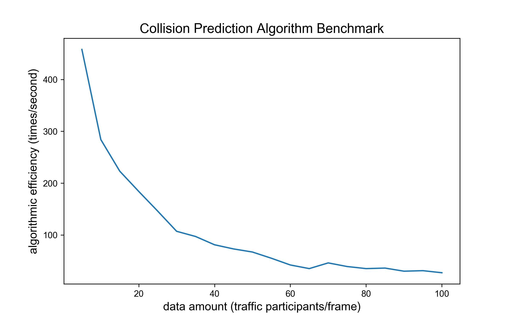
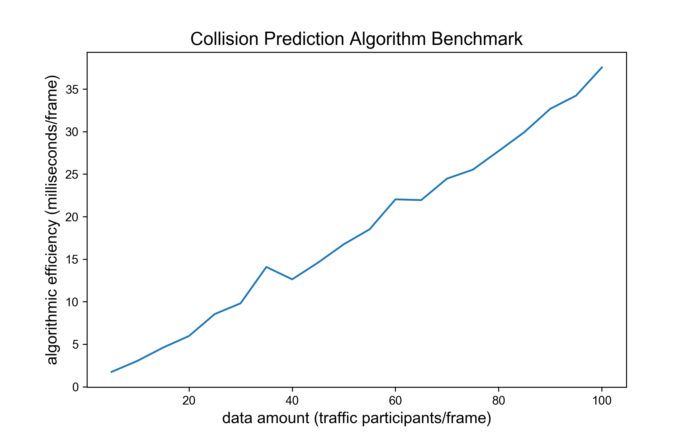
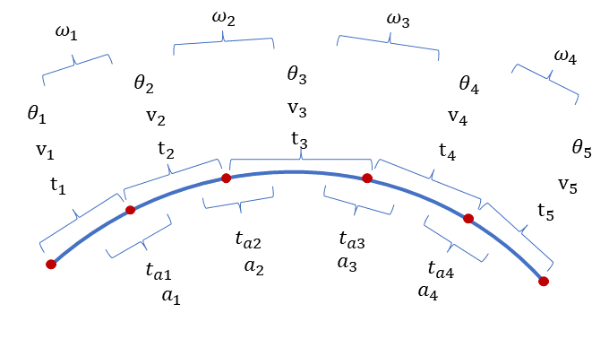
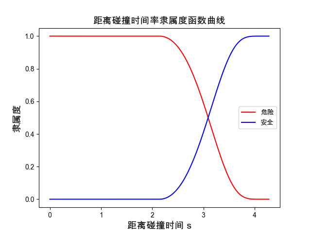
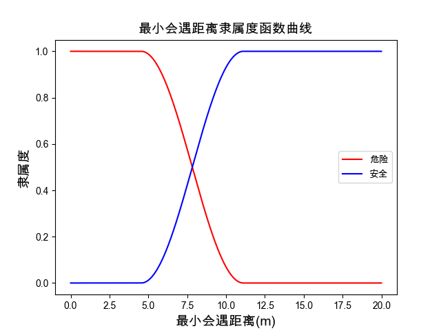
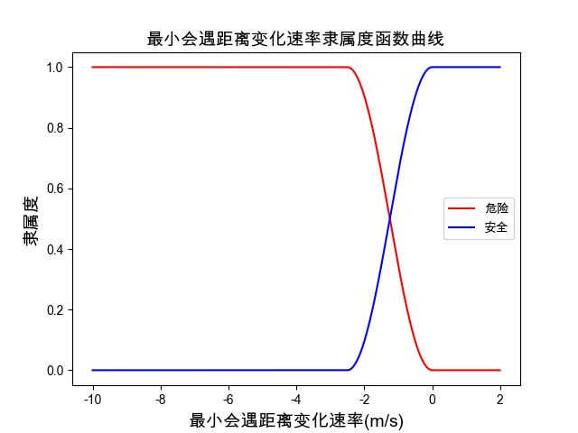
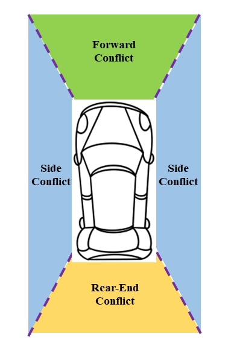

# 碰撞预警算法 (Collision Warning)

## 概览

### _目录_

<!-- @import "[TOC]" {cmd="toc" depthFrom=1 depthTo=6 orderedList=false} -->

<!-- code_chunk_output -->

- [碰撞预警算法 (Collision Warning)](#碰撞预警算法-collision-warning)
  - [概览](#概览)
    - [_目录_](#目录)
    - [难点与挑战](#难点与挑战)
    - [实现概览](#实现概览)
    - [算法BenchMark](#算法benchmark)
  - [碰撞预警算法及其对应版本](#碰撞预警算法及其对应版本)
    - [继承关系](#继承关系)
    - [调用](#调用)
  - [代码流程及框架](#代码流程及框架)
  - [碰撞预警算法解析](#碰撞预警算法解析)
    - [1. 碰撞算法实现框架: run函数](#1-碰撞算法实现框架-run函数)
    - [2. 算法模块逻辑](#2-算法模块逻辑)
      - [2.1 自适应未来轨迹推演](#21-自适应未来轨迹推演)
      - [2.2 未来轨迹碰撞冲突检查 _predict_motor_pair](#22-未来轨迹碰撞冲突检查-_predict_motor_pair)
      - [2.3 碰撞指标与危险度估计 _need_warning](#23-碰撞指标与危险度估计-_need_warning)
      - [2.4 碰撞指标阈值判别与预警信息生成](#24-碰撞指标阈值判别与预警信息生成)
  - [附录](#附录)
    - [参考文献](#参考文献)
    - [Configuration](#configuration)

<!-- /code_chunk_output -->

### 难点与挑战

- 兼顾效率与冲突研判多样：算法需同时实现车-车、车-非机动车、车-人的冲突风险研判，同时还需适配追尾、侧向、前向碰撞等多种碰撞类型。
- 兼顾提前预判与避免误报：预警时间越早，避免事故的机会越大；同时提前预警时间也会影响算法准确性，增加误报率。

### 实现概览


开发了多场景 V2X 碰撞风险研判与预警算法，实现了自适应未来轨迹推演、未来轨迹碰撞冲突检查、碰撞指标与危险度估计以及碰撞指标阈值判别与预警信息生成四大功能。 最后，碰撞预警算法流程均在 `run`
函数中，之后对算法流程讲解都从 `run` 开始

### 算法BenchMark

测试数据结构：每辆车及其 $10$ 帧历史数据信息

主要影响变量：data amount，每一帧数据包含的车辆数，data amount 由 $1$ 增至 $100$， 算法 $1$ 秒内运算次数由 $500$ 降至接近 $10$，运行单次算法耗时由
$2$ 毫秒增至 $40$ 毫秒。 导致耗时增加速率下降，主要由于车辆数增多，遍历配对运算数指数增长。 此算法满足在线要求。

 

## 碰撞预警算法及其对应版本

### 继承关系

V2xPrediction 类集成 Base 类，用于防止类未定义调用情况下的报错。

```python
class Base:
    def run(
        self, context_frames: dict, current_frame: dict, last_timestamp: int
    ) -> tuple:
        raise NotImplementedError


class V2xPrediction(Base):
    ...
```

### 调用

主要描述逆向超车算法如何创建和调用

① 初始化过程调用初始化函数，创建方式如下

```python
# 创建车辆碰撞预警
pred = collision.V2xPrediction(
    v2v_conflict_index=collision.ConflictIndex.TTC
)

# 创建弱势交通参与者碰撞预警
pred = collision.V2xPrediction(
    v2v_conflict_index=collision.ConflictIndex.PSD
)
```

② 调用过程由run函数执行，调用方式如下

```python
# 调用车辆碰撞预警
event_list, last_timestamp, _, _ = pred.run(
    his_frames, latest_frame, last_timestamp
    )

# 调用弱势交通参与者碰撞预警
event_list, last_timestamp, _, _ = pred.run(
    his_frames, latest_frame, last_timestamp
)
```

## 代码流程及框架

**输入**

| 数据类型     | 数据名称           | 数据格式 | 备注        |
| -------- | -------------- | ---- | --------- |
| **外部输入** | context_frames | AID  | 历史轨迹数据信息  |
| **外部输入** | current_frame  | AID  | 当前帧轨迹数据信息 |
| **外部输入** | last_timestamp | int  | 当前帧时间戳    |

**过程**

1. 自适应未来轨迹推演：计算交通参与者的运动学信息包括速度、加速度、角速度等，并根据运动学特征自动选取适当的轨迹预测模型，计算未来轨迹和足迹信息
2. 未来轨迹碰撞冲突检查：参与者之间进行不重复的两两碰撞检查
3. 碰撞指标与危险度估计：基于碰撞检查结果与参与者的时空位置信息，计算个参与者之间的碰撞风险指标
4. 碰撞指标阈值判别与预警：基于风险指标阈值判断预警迫切性，决定是否预警

**输出**

| 数据类型   | 数据名称             | 数据格式 | 备注                |
| ------ | ---------------- | ---- | ----------------- |
| **输出** | event_list       | list | 各子元素为CWM数据        |
| **输出** | motor_kinematics | dict | 当前帧各机动车的运动学信息     |
| **输出** | vptc_kinematics  | dict | 当前帧各弱势交通参与者的运动学信息 |
| **输出** | last_timestamp   | int  |                   |

**调控参数设置**

| 数据类型     | 数据名称                    | 数据格式  | 备注                                    |
| -------- | ----------------------- | ----- | ------------------------------------- |
| **调控参数** | predict_duration        | float | 预测未来轨迹的时间跨度，5s                        |
| **调控参数** | predict_interval        | float | 未来轨迹点的时间间隔，0.2s                       |
| **调控参数** | psd_max_dece            | float | 3.4m/s^2                              |
| **调控参数** | angular_speed_threshold | float | 模型切换的最小加速度阈值，0.157rad/s               |
| **调控参数** | acc_threshold           | float | 模型切换的最小加速度阈值，0.5m/s^2                 |
| **调控参数** | VehicleDefaultLength    | int   | 机动车的默认长度                              |
| **调控参数** | VehicleDefaultWidth     | int   | 机动车的默认宽度                              |
| **调控参数** | NonMotorDefaultRadius   | int   | 非机动车的默认半径                             |
| **调控参数** | PedestrianDefaultRadius | int   | 行人的默认半径                               |
| **调控参数** | displacement_threshold  | int   | 两参与者开始检查轨迹碰撞的最大间距阈值                   |
| **调控参数** | ttc_threshold           | float | 距离碰撞时间的预警阈值，2.14s                     |
| **调控参数** | FMRD_threshold          | float | FMRD模型的预警阈值，0.4                       |
| **调控参数** | v2v_conflict_index      | 枚举    | 用于计算车辆间碰撞危险度的指标（TTC、PSD）              |
| **调控参数** | v2vptc_conflict_index   | 枚举    | 用于计算车辆与弱势交通参与者的碰撞危险度的指标（TTC、PSD、FMRD） |
| **调控参数** | FMRD_weight             | list  | FMRD模型的因素集权重                          |

## 碰撞预警算法解析

### 1. 碰撞算法实现框架: run函数

- 参数初始化

```python
id_set, last_timestamp = process_tools.frames_combination(
            context_frames, self._current_frame, last_timestamp
        )
ptc_info: dict = {"motors": {}, "non_motors": {}, "pedestrians": {}}
```

- 分别计算机动车、非机动车、行人的运动学信息，用于检查未来碰撞情况

```python
motors, non_motors, pedestrians = self._filter_ptcs(
            context_frames, last_timestamp, id_set
        )
        for ptc_type in check_ptc:
            ptc_info[ptc_type + "_kinematics"] = getattr(
                self, "_prepare_{}_kinematics".format(ptc_type)
            )(locals()[ptc_type])
        vptc_kinematics = {
            **ptc_info["non_motors_kinematics"],
            **ptc_info["pedestrians_kinematics"],
        }
```

- 各车辆不重复的两两配对，检查碰撞情况与迫切情况，并生成事件数据

```python
self._v2v_collision_check(ptc_info["motors_kinematics"])
        self._v2vptc_collision_check(
            ptc_info["motors_kinematics"], vptc_kinematics
        )
        return (
            self._collision_warning_message,
            self._event_list,
            last_timestamp,
            ptc_info["motors_kinematics"],
            vptc_kinematics,
        )
```

### 2. 算法模块逻辑

1. 自适应未来轨迹推演：计算交通参与者的运动学信息包括速度、加速度、角速度等，并根据运动学特征自动选取适当的轨迹预测模型，计算未来轨迹和足迹信息
2. 未来轨迹碰撞冲突检查：参与者之间进行不重复的两两碰撞检查
3. 碰撞指标与危险度估计：基于碰撞检查结果与参与者的时空位置信息，计算个参与者之间的碰撞风险指标
4. 碰撞指标阈值判别与预警：基于风险指标阈值判断预警迫切性，决定是否预警

#### 2.1 自适应未来轨迹推演

- 调控参数

  | 数据类型     | 数据名称                    | 数据格式  | 备注                   |
  | -------- | ----------------------- | ----- | -------------------- |
  | **调控参数** | MinDataDuration         | float | 多少秒内的数据才参与计算车辆的动力学信息 |
  | **调控参数** | predict_duration        | float | 预测未来轨迹的时间跨度          |
  | **调控参数** | predict_interval        | float | 未来轨迹点的时间间隔           |
  | **调控参数** | angular_speed_threshold | float | 模型切换的最小加速度阈值         |
  | **调控参数** | acc_threshold           | float | 模型切换的最小加速度阈值         |

- **算法解读**

1. 速度、加速度、角速度计算：
   - 代码实现：
   ```python
   def _calc_speed_and_acc(self, kinematics: dict) -> None:
       x = kinematics["x"]
       y = kinematics["y"]
       heading = kinematics["heading"]
       timeStamp = kinematics["timeStamp"]

       # 运用差分公式计算历史轨迹的线速度、线加速度以及角速度，d表示导数
       xd = utils.differentiate(x, timeStamp)
       xdd = utils.differentiate(xd, timeStamp)
       yd = utils.differentiate(y, timeStamp)
       ydd = utils.differentiate(yd, timeStamp)
       hd = utils.differentiate(heading, timeStamp)

       # 基于历史轨迹的信息，计算均值作为估计的未来运动学信息
       kinematics["speed_x"] = utils.mean(xd)
       kinematics["speed_y"] = utils.mean(yd)
       kinematics["speed"] = np.linalg.norm(  # type: ignore
           [kinematics["speed_x"], kinematics["speed_y"]]
       ).tolist()
       kinematics["acc_x"] = utils.mean(xdd)
       kinematics["acc_y"] = utils.mean(ydd)
       kinematics["angular_speed"] = utils.mean(hd)
   ```

   如下图所示，首先计算各轨迹点之间的速度、航向角偏转值、加速度以及角速度。其次计算各运动学参数平均值，作为最后一个轨迹点的当前平均速度、加速度、角速度。点的数量由`MinDataDuration`
   调控。

   

2. 车辆未来轨迹与航向角计算：
   - 代码实现：
   ```python
   def _calc_traj_heading(self, kinematics: dict) -> None:
       self._traj_heading_map[self._traj_predict_model](kinematics)
   ```
   其中函数 `self._traj_heading_map` 中模型在初始化中被定义：
   ```python
   # 不同轨迹预测模型用不同的公式计算未来航向角，非恒定曲率 or 恒定曲率
   self._traj_heading_map = {
       TrajectoryPredictModel.CA: self._calc_traj_heading_nctr,
       TrajectoryPredictModel.CV: self._calc_traj_heading_nctr,
       TrajectoryPredictModel.CTRA: self._calc_traj_heading_ctr,
       TrajectoryPredictModel.CTRV: self._calc_traj_heading_ctr,
   }
   ```

   具体算法内置了如下四种轨迹预测模型：

   - CV (Constant Velocity) 恒定速度模型
   - CA (Constant Acceleration) 恒定加速度模型
   - CTRV (Constant Turn Rate and Velocity) 恒定转弯速率及速度模型
   - CTRA (Constant Turn Rate and Acceleration) 恒定转弯速率及加速度模型

   通过 `angular_speed_threshold` 判断是否使用考虑转弯速率的 CTR（Constant Turn Rate）类模型；通过 `acc_threshold`
   判断是否使用考虑加速度的 CA（Constant Acceleration）类模型。具体代码实现如下：

   函数 `self._calc_traj_heading_ctr` 为考虑恒定转向速率计算轨迹航向角
   ```python
   def _calc_traj_heading_ctr(self, kinematics: dict) -> None:
       # 当前航向角
       h0 = kinematics["heading"][-1]
       # 转向速率
       turn_rate = kinematics["angular_speed"]
       # 未来航向角信息为列表
       kinematics["traj_heading"] = [
           utils.normalize_radians(
               h0 + (self._predict_interval * (i + 1)) * turn_rate
           )
           for i in range(self._num_of_traj_points)
       ]
   ```

   函数 `self._calc_traj_heading_nctr` 为考虑非恒定转向速率计算轨迹航向角
   ```python
   def _calc_traj_heading_nctr(self, kinematics: dict) -> None:
       # 轨迹点元组列表
       traj_point = kinematics["traj_point"]
       # 不考虑转向速率的模型，无法计算航向角，用位移向量的方向代替表示
       kinematics["traj_heading"] = [
           utils.points_heading(traj_point[i], traj_point[i + 1])
           for i in range(self._num_of_traj_points - 1)
       ]
       # 最后一个未来轨迹点无法计算位移向量方向，用上一个航向角代替
       kinematics["traj_heading"].append(kinematics["traj_heading"][-1])
   ```

3. 未来轨迹的足迹计算：

   足迹（footprint） 指车辆占据道路的形状，算法分别对车辆与弱势交通参与者使用了基于条带的足迹计算和基于圆的足迹计算方法。

   - 代码实现：
   ```python
   def _calc_motor_footprint(self, kinematics: dict) -> None:
        # 足迹即车辆的矩形框位置信息
        kinematics["traj_footprint"] = [
            utils.build_rectangle(
                kinematics["traj_point"][i],
                kinematics["traj_heading"][i],
                kinematics["length"],
                kinematics["width"],
            )
            for i in range(self._num_of_traj_points)
        ]
   ```

   如下图所示，基于条带的足迹计算，用矩形表示车身形状；基于圆的足迹计算以圆近似交通参与者形状。

   

#### 2.2 未来轨迹碰撞冲突检查 _predict_motor_pair

- 调控参数

| 数据类型     | 数据名称                    | 数据格式 | 备注                  |
| -------- | ----------------------- | ---- | ------------------- |
| **调控参数** | VehicleDefaultLength    | int  | 机动车的默认长度            |
| **调控参数** | VehicleDefaultWidth     | int  | 机动车的默认宽度            |
| **调控参数** | NonMotorDefaultRadius   | int  | 非机动车的默认半径           |
| **调控参数** | PedestrianDefaultRadius | int  | 行人的默认半径             |
| **调控参数** | displacement_threshold  | int  | 两参与者开始检查轨迹碰撞的最大间距阈值 |

- **检查逻辑描述**

  对于一帧数据中的 $n$ 个车辆、$m$ 个弱势交通参与者，需要进行 $C^2_n$ 次车辆间碰撞检查以及 $n*m$ 次机动车与弱势参与者间碰撞检查。

  对于每一对参与者，依据轨迹点序列与足迹序列，基于多种空间几何图形位置判别函数，逐点计算两车辆的碰撞情况，若足迹在时空上有重叠，则认为存在碰撞的可能。

  ```python
  def _predict_motor_pair(self, ego: dict, other: dict) -> tuple:
          if not self._is_valid(ego, other):
              return {}, {}
          ego_traj, other_traj = (
              np.array(ego["traj_point"]),
              np.array(other["traj_point"]),
          )
          ego_fp, other_fp = ego["traj_footprint"], other["traj_footprint"]
          dis = abs(ego_traj - other_traj)
          # 逐轨迹点的时间顺序，判断碰撞，碰撞指两矩形重叠
          for k in range(self._num_of_traj_points):
              if any(
                  [
                      dis[k][0] < self._displacement_threshold,
                      dis[k][1] < self._displacement_threshold,
                  ]
              ):
                  if utils.is_rects_overlapped(ego_fp[k], other_fp[k]):
                      need_w = self._need_warning(ego, k)
                      if need_w:
                          return self._build_v2v_event(ego, other, k)
          return {}, {}

   def _predict_vptc_pair(self, motor: dict, vptc: dict) -> tuple:
          if not self._is_valid(motor, vptc):
              return {}, {}
          motor_traj_np = np.array(motor["traj_point"])
          vptc_traj_np = np.array(vptc["traj_point"])
          dis = np.linalg.norm(  # type: ignore
              motor_traj_np - vptc_traj_np, axis=1
          )
          motor_fp = motor["traj_footprint"]

          overlapped = False
          for k in range(self._num_of_traj_points):
              if dis[k] < self._displacement_threshold:
                  if utils.is_rect_and_circle_overlapped(
                      motor_fp[k], vptc["traj_point"][k], vptc["radius"]
                  ):
                      overlapped = True
                      break
          if self._v2vptc_conflict_index.name == "FMRD":
              TTC = (
                  (k + 1) * self._predict_interval
                  if overlapped
                  else 1.5 * self._ttc_threshold
              )
              need_w = self._warning_FMRD(motor, dis, TTC)
              if need_w:
                  return self._build_v2vptc_event(motor, vptc, k)
          elif overlapped:
              need_w = self._need_warning(motor, k)
              if need_w:
                  return self._build_v2vptc_event(motor, vptc, k)
          return {}, {}
  ```

#### 2.3 碰撞指标与危险度估计 _need_warning

- 调控参数

| 数据类型     | 数据名称                  | 数据格式  | 备注                                    |
| -------- | --------------------- | ----- | ------------------------------------- |
| **调控参数** | v2v_conflict_index    | 枚举    | 用于计算车辆间碰撞危险度的指标（TTC、PSD）              |
| **调控参数** | v2vptc_conflict_index | 枚举    | 用于计算车辆与弱势交通参与者的碰撞危险度的指标（TTC、PSD、FMRD） |
| **调控参数** | ttc_threshold         | float | 距离碰撞时间的预警阈值                           |
| **调控参数** | psd_max_dece          | float | 允许最大减速度                               |
| **调控参数** | FMRD_weight           | list  | FMRD模型的因素集权重                          |

- **基于TTC的时间接近度碰撞指标计算**

```python
def _warning_TTC(self, ego: dict, k: int) -> bool:
        TTC = (k + 1) * self._predict_interval
        if TTC < self._ttc_threshold:
            return True
        return False
```

距离碰撞时间( Time to Collision, TTC)是使用最为广泛的碰撞指标，最适用于追尾冲突，其定义为“如果保持碰撞方向和速度差，两辆车发生碰撞前剩余的时间”, 公式如下：

$$ TTC = \frac{d}{\Delta{v}} $$

其中 $d$ 是车辆 1 与车辆 2 之间的空间间隙，$\Delta{v}$ 是两车之间的速度差。

TTC 临界阈值一般假定为 $2s$ 至 $3s$。若冲突双方的 TTC 小于临界阈值，则认为双方之间存在严重冲突，甚至有很大概率发生碰撞，触发预警机制。

- **基于PSD的时间接近度碰撞指标计算**

```python
def _warning_PSD(self, ego: dict, k: int) -> bool:
        # RD 距碰撞点的距离
        RD_x = ego["traj_point"][k][0] - ego["x"][-1]
        RD_y = ego["traj_point"][k][1] - ego["y"][-1]
        # 按最大减速度，静止的最短距离  x = v ** 2 / (2 * a)
        MSD_x = (ego["speed_x"] ** 2) / (
            2 * self._psd_max_dece * math.sin(ego["traj_heading"][k])
        )
        MSD_y = (ego["speed_y"] ** 2) / (
            2 * self._psd_max_dece * math.cos(ego["traj_heading"][k])
        )
        if RD_x < MSD_x or RD_y < MSD_y:
            return True
        return False
```

停车距离比( Proportion of Stopping Distance, PSD)
是广泛使用的基于距离接近度的冲突指标，是指相互靠近的存在碰撞可能性的双方中的一方发现冲突对象时距离潜在碰撞点的剩余距离与最小可接受停止距离之间的比值如下式所示：

$$ PSD = \frac{RD}{MSD} $$

其中 $RD$ 是距离潜在碰撞点的距离，$MSD$ 是最小可接受停止距离。

通常 $MSD$ 是驾驶员或者骑行者以最大可接受减速度减速至完全停下来的距离，如下式所示:

$$ MSD = \frac{v^2}{2a_{max}} $$

其中 $v$ 是驾驶员或者骑行者发现冲突开始减速的起始初速度， $a_{max}$ 是最大可接受减速度。算法选取美国国家公路与运输协会 (AASHTO) 推荐的 $3.4 m/s^2$
作为大多数驾驶员的最大可接受减速度。

若冲突双方发现冲突时的 $RD$ 小于其 $MSD$，则认为双方之间存在严重冲突，甚至有很大概率发生碰撞，触发预警机制。

- **基于模糊数学的弱势交通群体碰撞危险度估计**

```python
def _warning_FMRD(self, ego: dict, dis, TTC: float) -> bool:
        TTC_membership = utils.TTCMembership(TTC, self._ttc_threshold)
        # MMD is min_meeting_distance
        MMD_index = np.argmin(dis)
        MMD_membership = utils.MMDMembership(
            float(dis[MMD_index]), ego["speed"], self._psd_max_dece
        )
        # MMS is min_meeting_speed
        MMS = (
            float(dis[MMD_index] - dis[MMD_index - 1]) / self._predict_interval
            if MMD_index != 0
            else -10
        )
        MMS_membership = utils.MMSMembership(MMS, ego["speed"])
        membership = np.mat(  # type: ignore
            [TTC_membership, MMD_membership, MMS_membership]
        )
        fused_membership = self._fmrd_weight * membership
        fused_membership = fused_membership.getA()[0]
        if fused_membership[1] > fused_membership[0]:
            scaled_fused_membership = (fused_membership[1] - 0.5) / 0.5
            if scaled_fused_membership > self._fmrd_threshold:
                return True
        return False
```

方案提出了基于模糊数学的碰撞危险度指标（Fuzzy Mathematics Based Risk Degree,
FMRD）。基于模糊数学评价的思想，**选取距离碰撞时间（TTC）、最小会遇距离（MMD）、最小会遇距离变化速率（MMS）三种指标**构建因素集，从迫切性与严重性两个维度，分别构造安全评价与危险评价的隶属度函数，最终得到融合危险度。各因素及隶属度函数如下：

1. TTC在危险度函数中起决定性作用。以 `ttc_threshold` 为界，将 TTC 因素的评价集区间划分为和两个等级，分别代表危险与安全，各自的隶属度函数与曲线如下：

   

2. 最小会遇距离（MMD）是 TTC 的补充属性，当参与者 `predict_duration` 时间内的轨迹不交叉时，TTC
   为无限大，但两者在未来仍有碰撞的可能，考虑最小会遇距离可以弥补这一问题，且相当于将危险判别的时间进一步延长至大于 `predict_duration` 。以最小减速距离 $D_{md}$
   和绝对安全距离 $D_{s}$ 为界，将 MMD 因素的评价集区间划分为和两个等级，分别代表危险与安全，各自的隶属度函数与曲线如下：

   

3. 最小会遇距离变化速率（MMS）用于评价冲突若转化为碰撞所导致的严重性。以最小安全速率 $v{smin}$ 和 $0$ 为界，将 MMS
   因素的评价集区间划分为和两个等级，分别代表危险与安全，各自的隶属度函数与曲线如下：



基于权重融合上述因素的隶属度，可得到安全与危险的综合隶属度为

$$ E = W · R = \begin{bmatrix} a_t & a_d & a_v \end{bmatrix} · \begin{bmatrix} r_t^S & r_t^D \\
r_d^S & r_d^D \\ r_v^S & r_v^D \end{bmatrix}=\begin{bmatrix} e_S & e_D \end{bmatrix} $$

其中，$W$ 为权重集，$R$ 为根据隶属度函数得到的冲突危险度评价矩阵，$E$ 是综合隶属度矩阵，表示人车冲突属于安全等级的程度，$e_{s}$ 则表示人车冲突属于危险等级的程度。

当 $e_{S} > e_{D}$ 时，可认为未来 $2s$ 内的人车交互是安全的；当 $e_S < e_D$ 时则认为未来 $2s$ 内的人车交互是存在碰撞风险的。

最后，通过等比例缩放将的取值范围从 [0.5,1] 缩放至 [0,1]，作为最终冲突危险度的取值。

#### 2.4 碰撞指标阈值判别与预警信息生成

- 调控参数

| 数据类型     | 数据名称           | 数据格式  | 备注          |
| -------- | -------------- | ----- | ----------- |
| **调控参数** | ttc_threshold  | float | 距离碰撞时间的预警阈值 |
| **调控参数** | FMRD_threshold | float | FMRD模型的预警阈值 |

- **碰撞指标阈值判别**

对于 TTC 指标，参考美国联邦公路管理局、美国道路通行手册的推荐范围值以及近5年相关领域学术论文的 TTC 阈值选定情况，选取 $2.14s$ 作为默认推荐判断阈值。

对于 PSD 指标，选取美国国家公路与运输协会 (AASHTO) 推荐的 $3.4 m/s^2$ 作为大多数驾驶员的最大可接受减速度，PSD 的预警阈值由公式结构决定，固定为 $1$。

对于 FMRD 指标，依据采集到的大量实验，经过对比优化，选取 $0.4$ 为预警阈值。

- **碰撞类别等预警信息计算**

在预警信息中碰撞类别信息需要额外计算，如图所示，基于两参与者的航向角度差定义三种碰撞类别。前向碰撞（ForwardConflict）、侧向碰撞（SideConflict）与追尾碰撞（RearEndConflict）。



## 附录

### 参考文献

- Arun A , Haque M M , Washington S , et al. A Systematic Review of Traffic Conflict-Based Safety
  Measures with a Focus on Application Context[J]. Analytic Methods in Accident Research, 2021,
  32(2):100185.
- 徐言民,张云雷,沈杰,邹春明,关宏旭,赵威.基于模糊集合理论的船舶碰撞危险度模型[J].舰船科学技术,2021,43(07):82-87.
- 朱顺应,蒋若曦,王红,邹禾,汪攀,丘积.机动车交通冲突技术研究综述[J].中国公路学报,2020,33(02):15-33.DOI:10.19721/j.cnki.1001-7372.2020.02.002.

### Configuration

- model name : Intel Core 6 i7 @ 2.6 GHz （x86_64）
- compiler: Python 3.7.4 [Clang 12.0.0 (clang-1200.0.32.29)] on darwin
