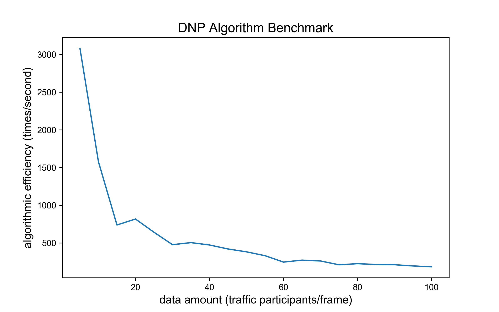
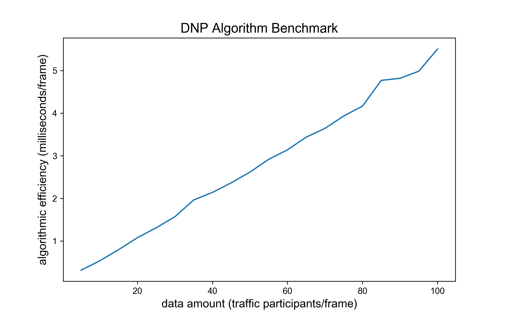

# 逆向超车预警(Do Not Pass Warning)

## 概览

### _目录_

<!-- @import "[TOC]" {cmd="toc" depthFrom=1 depthTo=6 orderedList=false} -->

<!-- code_chunk_output -->

- [逆向超车预警(Do Not Pass Warning)](#逆向超车预警 do-not-pass-warning)
  - [1. 概览](#概览)
    - [1.1 算法目标](#算法目标)
    - [1.2 难点与挑战](#难点与挑战)
    - [1.3 实现概览](#实现概览)
  - [2. 算法](#算法)
    - [2.1 算法介绍](#算法介绍)
    - [2.2 算法输入、输出与调控参数](#算法输入、输出与调控参数)
    - [2.3 算法逻辑](#算法逻辑)
    - [2.4 算法 BenchMark](#算法-Benchmark)
  - [3. 算法代码框架](#算法代码框架)
    - [3.1 继承关系](#继承关系)
    - [3.2 调用关系](#调用关系)
  - [4. 参数示例解析](#参数示例解析)
    - [4.1 输入参数解析](#继承关系)
    - [4.2 输出参数解析](#调用关系)
  - [5. 算法代码解析](#算法代码解析)
  - [6. 附录](#附录)
    - [参考文献](#参考文献)
    - [Configuration](#configuration)

<!-- /code_chunk_output -->

## 1. 概览

### 1.1 算法目标

本算法主要是基于 V2X
通信技术，在道路交通中，车辆与车辆之间通过该项技术进行数据交互，将自身的各项基本信息，如位置信息，经度纬度，速度信息，车辆的状态信息发送给其他车辆，同时也将接收其他车辆的基本信息然后进行算法处理操作，判断出车辆在借道超车的的过程中，是否存在与对向车辆存在碰撞的危险。

### 1.2 难点与挑战

- 共享请求车辆的重定位：在具有一定通讯延时与处理延时的情况下，算法需通过请求数据，从检测目标中定位请求车辆。
- 在线风险判别：算法需仅根据有限的历史数据，在线研判车辆驾驶风险。

### 1.3 实现概览

逆向超车预警流程图待补充


逆向超车概览仅描述算法数据输入、算法处理逻辑、算法输出三步骤，其余将在代码流程中详细讲解。

1. 逆向超车预警指接收 OBU 的逆向超车请求，同时调取当前时刻车辆位置信息。
2. 车辆逆向换道意图将被假设发生，并研判该假设下逆向超车的完成的可行时段内是否存在碰撞风险
3. 若存在碰撞风险则返回预警信息，阻止车辆逆向超车行为

最后，逆向超车算法流程均在 `run` 函数中，之后对算法流程讲解都从 `run` 开始

## 2. 算法

### 2.1 算法介绍

### 2.2 算法输入、输出与调控参数

| 数据类型       | 数据名称                    | 数据格式    | 备注                                 |
| ---------- | ----------------------- | ------- | ---------------------------------- |
| **外部输入**   | his_pkg                 | AID     | 历史轨迹信息                             |
| **外部输入**   | curr_pkg                | AID     | 当前轨迹信息                             |
| **外部输入**   | msg_VIR                 | dict    | 车辆驾驶行为请求标准 msg 消息                  |
| **算法内部参数** | OVERTACKING_TIME = 9000 | int     | 通用超车所需时间：9 秒                       |
| **算法内部参数** | MIN_TRACK_LENGTH = 3    | int     | 计算期望历史轨迹最小长度                       |
| **输出**     | msg_rsc                 | msg_RSC | 逆向超车算法返回给 OBU 的路侧协调信息              |
| **输出**     | show                    | dict    | 逆向超车算法返回给前端展示的事件及位置信息标准 msg_RSC 消息 |

### 2.3 算法逻辑

1. 根据车辆经纬度位置匹配主车 `ID`
2. 检查并计算主车换道意向的目标车道中最具碰撞风险车辆的最小 `TTC`
3. 判定此 `TTC` 下主车是否足够完成逆向超车，若不能，则返回风险信息

### 2.4 算法BenchMark

测试数据结构：每辆车及其 10 帧历史数据信息

主要影响变量：data amount，每一帧数据包含的车辆数，data amount 由 $1$ 增至 $100$， 算法 $1$ 秒内运算次数由 $3000$ 降至接近
$100$，运行单次算法耗时由 $0$ 毫秒增至 $6$ 毫秒。 导致耗时增加速率下降，主要由于车辆数增多，遍历对向车道车辆计算运算数指数增长。 此算法满足在线要求。

 

## 3. 算法代码框架

### 3.1 继承关系

Retrograde 类集成 Base 类，用于防止类未定义调用情况下的报错。

```python
lass Base:
    """Super class of DoNotPass class."""

    def run(
        self,
        context_frame: dict = {},
        latest_frame: dict = {},
        msg_VIR: dict = {},
    ) -> tuple:
        """External call function."""
        raise NotImplementedError
class Retrograde(Base)
    ...
```

### 3.2 调用关系

主要描述逆向超车算法如何创建和调用。

① 初始化过程直接采用类默认初始化函数，创建方式如下

```python
DNPW = Retrograde()
```

② 调用过程由 `run` 函数执行，调用方式如下

```python
msg_rsc, show = DNPW.run(his_pkg, curr_pkg, msg_VIR)
```

## 4. 参数示例解析

**4.1 输入参数解析**

| 数据类型     | 数据名称     | 数据格式 | 备注                    |
| -------- | -------- | ---- | --------------------- |
| **外部输入** | his_pkg  | AID  | 历史车辆轨迹信息              |
| **外部输入** | curr_pkg | AID  | 历史车辆轨迹信息              |
| **外部输入** | msg_VIR  | dict | 车辆驾驶行为请求标准 msg_VIR 消息 |

```json
msg_VIR : dict
-------
{
"msgCnt": "1",
"id": "215.0",
"refPos": {"lon": 319353414, "lat": 1188217928, "ele": 100},
"secMark": 49100,
"intAndReq": {
    "currentBehavior": 2,
    "reqs": {"reqID": 1,
                "status": 2,
                "targetRSU": "100001",
                "info": {
                    "laneChange": {
                    "upstreamNode":"",
                    "downstreamNode":"",
                    "targetLane": 2}},
                "lifeTime": 500,
                }
        }
}
```

**4.2 输出参数解析**

| 数据类型   | 数据名称    | 数据格式    | 备注                                 |
| ------ | ------- | ------- | ---------------------------------- |
| **输出** | msg_rsc | msg_RSC | 逆向超车算法返回给 OBU 的路侧协调信息              |
| **输出** | show    | dict    | 逆向超车算法返回给前端展示的事件及位置信息标准 msg_RSC 消息 |

```json
msg_rsc : dict
-------
{
    "msgCnt": ,
    "id": ,
    "secMark": ,
    "refPos": {"lon": 319353414, "lat": 1188217928, "ele": 100},
    "coordinates": {
        "vehId": "1.0",
        "driveSuggestion": {"suggestion": 1, "lifeTime": 500},
        "pathGuidance":[{
            "pos":{"lon":, "lat":, "ele":},
            "speed": ,
            "heading": ,
            "estimatedTime":
            }, ...], # 预留100个点 0.1s一个点
        "info": 0  # cooperativeLaneChanging(0)
    }
}

show : dict
----
{
    "type": "DNP",
    "ego_point": {
        "x": 10.0,
        "y": 10.0,
    },
    "if_accept": True,
}
```

## 5. 算法代码解析

代码流程详细剖析：

1. 检验逆向超车事件是否发生

```python
rtg = self.__if_retrograde()  # rtg is retrograde: bool
if not rtg:  # 并非逆行
    return {}, msg_rsc
```

根据地图数据或车道走向预设判断当前车道与目标车道是否为逆向车道 若为逆向车道返回 True，否则返回 False

```python
def __if_retrograde(self):
    # 找到当前msg车辆车道# 找到目标车道# 判断是否是逆行超车 self.veh_id = self.__id_get()
    if "lane" not in self.curr_pkg[self.veh_id]:
        return Falsec_lane = self.curr_pkg[self.veh_id]["lane"]
    a_lane = self.msg_VIR["intAndReq"]["reqs"]["info"]["retrograde"][
        "targetLane"
    ]
    if self.__direction_acqu(c_lane) * self.__direction_acqu(a_lane) < 0:
        self.aim_lane = a_lanereturn Truereturn False
```

2. 对计划发生逆向超车的车辆计算与目标车道车辆的最小 `TTC` ：risk_ttc

```python
# 找到逆行车要去的车道的所有来向车，计算ttc
risk_veh, risk_ttc = self._potential_risk()
        operation = 1
        effect = self.OvertakingTime
```

遍历当前车辆和目标车道所有车辆 判断目标车道车辆是否已经通过当前车辆位置 如果在当前车辆前方则根据两车距离计算 `TTC` 记录所有 `TTC` 中最小值作为 `risk_ttc`

```python
def _potential_risk(self) -> tuple:
        # 目标车道所有车辆，和当前车计算：
        # 判断前后，如果已通过则continue
        # 如果迎面，距离 -> TTC -> 记录TTC
        risk_veh = ""
        risk_ttc = 100000.0
        for veh_temp in self.latest_frame:
            if self.latest_frame[veh_temp]["ptcType"] != "motor":
                continue
            if self.latest_frame[veh_temp]["lane"] == self.aim_lane:
                ttc = self._predict_ttc(self.veh_id, veh_temp)
                if ttc < risk_ttc and ttc > 0:
                    risk_veh = veh_temp
                    risk_ttc = ttc
        return risk_veh, risk_ttc
```

3. 判断此时最小的 `TTC` 是否满足逆向超车要求

```python
if risk_ttc < self.OvertakingTime:
            operation = 0
            effect = risk_ttc
        msg_rsc, show_info = self._suggests_generation(effect, operation)
```

将计算得到的结果和风险生成返回值格式

```python
def _suggests_generation(self, time, operation):
        operation_dic = {1: True, 0: False}
        show_info = {
            "type": "DNP",
            "ego_point": {
                "x": self.latest_frame[self.veh_id]["x"],
                "y": self.latest_frame[self.veh_id]["y"],
            },
            "if_accept": operation_dic[operation],
        }
        effect = time * 0.1
        msg_rsc = {}
        msg_rsc.update(
            {
                "msgCnt": self.msg_VIR["msgCnt"],
                "id": self.msg_VIR["id"],
                "secMark": self.msg_VIR["secMark"],
                "refPos": self.msg_VIR["refPos"],
                "coordinates": {
                    "vehId": self.msg_VIR["id"],
                    "driveSuggestion": {
                        "suggestion": operation,
                        "lifeTime": int(effect),
                    },
                    "pathGuidance": [],
                    "info": 0,
                },
            }
        )
        return msg_rsc, show_info
```

## 6. 附录

### 参考文献

- Li T, Wu J, Chan C Y, et al. A cooperative lane change model for connected and automated
  vehicles[J]. IEEE Access, 2020, 8: 54940-54951.

### Configuration

- model name : Intel Core 6 i7 @ 2.6 GHz （x86_64）
- compiler: Python 3.7.4 [Clang 12.0.0 (clang-1200.0.32.29)] on darwin
